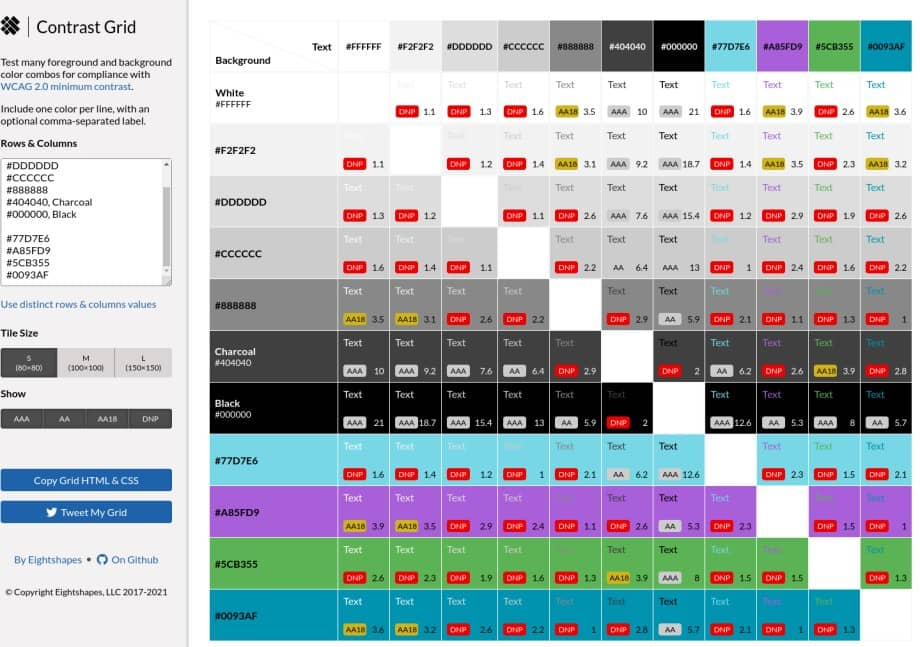
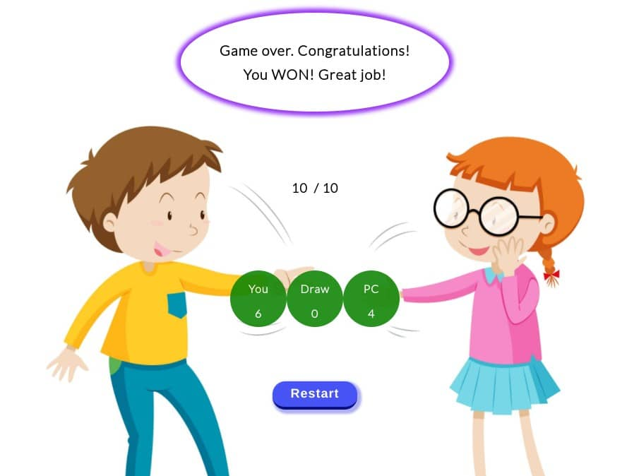
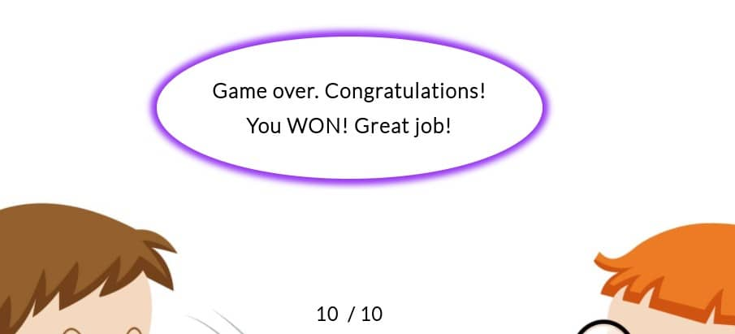
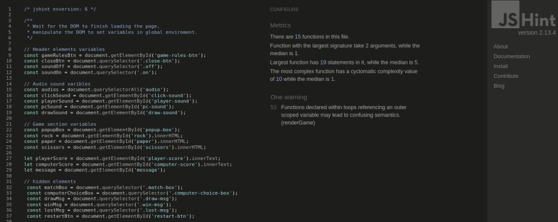
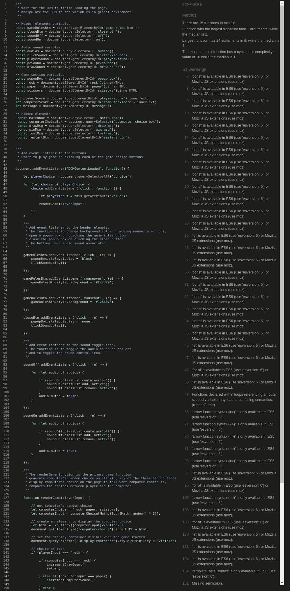
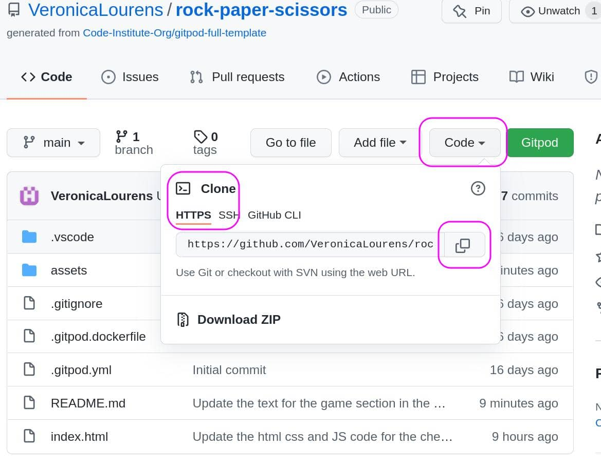

# Rock Paper Scissors

## Site Overview

Rock Paper Scissors game is an interactive easy yet super fun game for everyone especially for little children who love to play it often with families and friends. More than often that children are interested in playing games on media screens nowadays. The site intends to target the audience who enjoys play against the computer in their spare time. 

Click here to view the live website - [Rock Paper Scissors](https://veronicalourens.github.io/rock-paper-scissors/)


  
  ## Table of Content
  
  - [User Experience UX](#user-experience-ux)
  - [Existing Features](#existing-features)
  - [Technologies Userd](#technologies-userd)
  - [Testing](#testing)
  - [Deployment](#deployment)
  - [Credit](#credit)
  - [Acknowledgement](#acknowledgement)

## User Experience UX

* ### User Stories
  
  * As a first time user, I want the website to be easily accessible on different devices and work on different browsers.
  * As a first time user, I want the site to have a vivid theme.
  * As a returning user, I want to know what the game rules are and how to play it.
  * As a game user, I want to know the game scores and result of win or lost.

[Back to top](#rock-paper-scissors)

* ### Site Owner Stories
  
  The purpose of the website is to provide a fun and exciting easy game for young and old to enjoy. The site should be accessible and responsive on different media screens and browsers.

* ### Wireframe
  

[Back to top](#rock-paper-scissors)

* ### Design Choice
  * Color Theme
  
      The site uses white color for the background and black color for the text. It has a lovely picture of two playful children playing the Rock Paper Scissors game for the background of the game section. The site uses bright colors based on the color theme that the colors change slidely to darker color. There are many different shapes with different colors to attract little children. The design is child and family friendly to attract little audience.

      

      <details><summary>Color contrast grid.</summary>

      

      </details>


  * Typography
  
      The site's main font-family is Lato that is easy to read. The fall back font-family is Open Sans.

[Back to top](#rock-paper-scissors)

## Existing Features
The website has only one page. The header on the top, the game area in the middle of the page that has a background picture, short texts and the game choices. The footer is on the bottom of the site. 

Some of the page content are hidden when the page loaded. The hidden content would be displayed after user interacts with the page by clicking the buttons. The audio sound is muted by default. There is a sound toggle icon to toggle the audio sound.

The website is created using **mobile-first design approach** and added media queries for the larger media screens. It is responsive accordingly on the different sizes of media screens from 320px up to 4000px.

[Back to top](#rock-paper-scissors)

* ### Header
  
  The Header contains the name of the game **Rock Paper Scissors** on the left side, **Game Rules** button and the sound **on** and **off** image on the right. 
  
  The **Game Rules** button has a hover function that changes background color and horizontally shift to left and right when the mouse moves in and out. 

    

[Back to top](#rock-paper-scissors)

* ### Game section

  * The pop up box contains the game rules that appears on the page after user clicks the **Game Rules** button on the header.

    


  * A title **Select your choice to play** indicates to start the game by clicking the **hand** buttons. The **hand** buttons are animated that has the zoom and turning effects.
  

    

  [Back to top](#rock-paper-scissors)

  * The **messages**, **round count**, **computer choice** and **scores** are displayed on the page after user starts to play the game by clicking the hand buttons.

    

  [Back to top](#rock-paper-scissors)

  * A game over message, total rounds, final game scores and a restart button are displayed on the page when the game reaches 10 rounds. It tells the user the final result. 
  
  * The Restart button indicates to user to re-play the game again. All of the data would be reset to the initial state. The page would be reloaded on clicking the Restart button.

    

    

    <details><summary>Game over lost message.</summary>

    

    </details>

    <details><summary>Game over draw message.</summary>

    

    </details>


    

[Back to top](#rock-paper-scissors)

* ### Footer
  
  The footer of the page contains a copyright text and social media links.

  

  [Back to top](#rock-paper-scissors)

* ### Future Features

  Additional animation to be added with celebration audio sound and big emojis for praise user’s achievement. An option of user account to be implemented for saving the game records each time user plays the game.

[Back to top](#rock-paper-scissors)

## Technologies Userd
* [HTML5]() - to create site's structure of the content.
* [CSS]() - to style the website content.
* [JavaScript]() - to make to site interactive with buttons' clickable functionalities.
* [GitHub]() - to host and deploy the website with its content.
* [GitPod]() - to edit the code and push the code to GitHub page.
* [W3C Markup Validator](https://validator.w3.org/) - validates the site's HTML code.
* [W3C CSS Jigsaw Validator](https://jigsaw.w3.org/css-validator/) - validates the site's CSS code.

* [JSHint](https://jshint.com) - to validate the site's JavaScript code.
* [Responsive design checker]() - to check the site's responsiveness.
* [Favicon generator]() - to generate the site's favicon icon.
* [Am I Responsive](http://ami.responsivedesign.is) - generates the site's responsiveness preview image on the top of the README file.

* [Chrome Dev Tools]() - carries out the **Lighthouse** testing and debug.


[Back to top](#rock-paper-scissors)

## Testing
* ### Code Validation

  The **Rock Paper Scissors** site's HTML, CSS and JavaScript codes have been validated by the **W3C HTML Markup Valication**, **W3C CSS Validation** and **JSHint Validation** services by entering the site's URL address.
  * W3C Markup Validation - No errors found.
    
    


  * W3C CSS Validation - No errors found.

    

  * JSHint JavaScript Validation - One warning found.

    * Metrics:
  
      * ```There are 15 functions in the script file.```
      * ```Functions with the largest signature take 2 arguments, while the median is 0.```
      * ```Largest function has 19 statements in it, while the median is 6.```
      * ```The most complex function has a cyclomatic complexity value of 10 while the median is 2.```
  
    * One warning:

      ```56 Functions declared within loops referencing an outer scoped variable may lead to confusing semantics. (renderGame)```

      This warning is caused by the function declared within the **for loop** at line **56** in the script.js file. The function fires on the click event that loop through each of the elements that has a **class** attribute with the value of **choice**.


        


[Back to top](#rock-paper-scissors)

* ### Lighthouse Testing

  The site has been tested on Chrome Incognito window using Dev Tools for both mobile and the desktop.

  * Desktop
  
    

[Back to top](#rock-paper-scissors)

  * Mobile

    

[Back to top](#rock-paper-scissors)

* ### Responsiveness Testing

  * The website has been manually tested and passed on the **Google Chrome Dev Tools** and the **Responsive Design Checker**.

  |       | **Moto G4** | **Galaxy S5** | **iPhone 5** | **iPad** | **iPad Pro** | **Display < 1200px** | **Display <= 4000px** |
  |-------|:-----------:|:-------------:|:------------:|:--------:|:------------:|:--------------------:|:---------------------:|
  |Render |  &check;    |   &check;     |   &check;    |  &check; |    &check;   |        &check;       |        &check;        |  
  |Image  |  &check;    |   &check;     |   &check;    |  &check; |    &check;   |        &check;       |        &check;        |   
  |Links  |  &check;    |   &check;     |   &check;    |  &check; |    &check;   |        &check;       |        &check;        | 

[Back to top](#rock-paper-scissors)

  * The website has been tested and passed on my own devices. It is fully responsive on two desktops, two laptops, iPad Air and  three mobile phones. 

  |       |**Galaxy Note4**|**Nokia 7 Plus**|**Huawei P30 Pro**|**iPad Air**|**Lenovo E540**|**HP Elitebook 850 G5**|**DELL 2407WFP**|**Yiyama ProLite XB3288UHSU**|
  |-------|:--------------:|:--------------:|:----------------:|:----------:|:-------------:|:---------------------:|:---------------:|:--------------------------:|
  |Render |    &check;     |   &check;      |      &check;     |   &check;  |    &check;    |        &check;        |     &check;     |        &check;             |
  |Image  |    &check;     |   &check;      |      &check;     |   &check;  |    &check;    |        &check;        |     &check;     |        &check;             |
  |Links  |    &check;     |   &check;      |      &check;     |   &check;  |    &check;    |        &check;        |     &check;     |        &check;             |

[Back to top](#rock-paper-scissors)

* ### Browser Compatibility Testing

  The website has been tested on the following browers. The site's compatibility and the functionality are fine with no issues. The website's appearence looks good using the following browsers. 

  * **Google Chrome**
  * **Microsoft Edge**
  * **Safari**

[Back to top](#rock-paper-scissors)

* ### Resolved Known-bugs

  * #### Lighthouse texting bugs
  
    * Background and foreground colors do not have a sufficient contrast ratio;
  
      * Adjusted the background color for the game rules and restart button to solve the problem.
  
    * First Content Paint and Largest Contentful Paint;
  
      * Replaced the background image with compressed and resized image to solve the problem.
  
    * Document doesn't use legible font size;
  
      * Increased the font-size and changed the font size units to slove the problem.
  
    * Overlapping header elements and social media links.

      * Added margin to the header elements and social media links to solve the problem.

  * #### JSHint JavaScript Validation Warnings
  
    * There were total 51 warnings:
  
      * 4 Missing semicolons;
      * 1 Undefined variable: drawCount;
      * 1 Functions declared within loops referencing an outer scoped variable may lead to confusing semantics;
      * 45 Warnings about ES6.

        <details><summary>JSHint validation result.</summary>

          

        </details>


    * I took the following steps to improve and close the warnings:
  
      * Added semicolons to the four lines of code where they were missing .
      * Deleted the undefined variable **drawCount**.
      * Added a comment of **jshint esversion: 6** to the top of the script.js file.


[Back to top](#rock-paper-scissors)

* ### Testing User Stories

  * As a first time user, I want the website to be easily accessible on different devices and work on different browsers.
  
    * User is able to access the site on different media screens using **Google Chrome**, **Microsoft Edge**, **Safari**, **Mozilla Firefox**.
  
  * As a first time user, I want the site to have a vivid theme.

    * The site contains a vivid background picture and a variety of colors and shapes. 
  
  * As a returning user, I want to know what the game rules are and how to play it. 
  
    * User is able to find the game rules and instructions by clicking the **Game Rules** button on the header.
  
  * As a game user, I want to know the game scores and result of win or lost.

    * User is able to see the game scores, move counts, draw numbers and the message on clicking each of the hand buttons. User is informed with the final result with a popup message box.


## Deployment

* ### Site Deployment
  
  The Rock Paper Scissors game website is deployed to GitHub page. The site's link -  https://veronicalourens.github.io/rock-paper-scissors/

  Steps to deploy the site as the following:
   * On my GitHub rock-paper-scissors repository, select the **Setting** tab.;
   * Then navigate to the **Pages** on the left side of the page;
   * Select **main** from the **Branch** box and click **save**;
   * Refresh the page, go back to the **Pages**, a ticked message with a link in the green box that shows the site is successfully deployed.
      
      


[Back to top](#rock-paper-scissors)

* ### Clone the Project
  
  Steps to clone the project from GitHub as following:
  1. On my GitHub rock-paper-scissors repository page, click the **Code** tab next to the green **Gitpod** button;
  2. In the **Clone** board, click the icon on the right side of the URL under **HTTPS** to copy the given URL;
  3. Go to the local IDE of your choice.
  4. Type **git clone** in the terminal, then paste the copied URL from GitHub;
  5. Press **Enter** to complete the clone process.

     

   
[Back to top](#rock-paper-scissors)

## Credit

* ### Content
  * [Google Fonts](https://fonts.google.com/specimen/Lato#standard-styles) - provides the fonts for the site.

  * [Font Awesome](https://fontawesome.com/) - provides the hand icons used for the game.

  * [Adobe Color](https://color.adobe.com/create/color-wheel) - extract the site's color theme.
  * [EightShape Contrast](https://contrast-grid.eightshapes.com/) - color contrast grid.

* ### Media
 
  * [Freepik](https://www.freepik.com/) - provides the background image for free.
  * [Free icon shop](https://freeiconshop.com/) - provides the audio sound control icons.
  * [Fesliyanstudios](https://www.fesliyanstudios.com/) - provides the audios for the buttons and messages.
 
  * [MDN Web Docs](https://developer.mozilla.org/en-US/) - provides reference materials.
  * [Stack Overflow](https://stackoverflow.com/) - provides extra support information.
  * [Slack]() - provides extra support for the course and the project.
 
  * [Youtube](https://www.youtube.com/) - provides extra learning materials.
  * [Compressor](https://compressor.io/) - to compress the site's image and screenshots.

* ### Code
    * The CSS code for the box shadow and hover effect were based on the understanding of the examples on [W3C School](https://www.w3schools.com/) website.
    * The CSS code for the sticky footer were based on the knowledge gained on [CSS-TRICKS]().
    * The JS code to toggle the audio sound were inspired by the guidance from [Dave Gray]() on YouTube. 
    * The code to hide the images in README file was based on the project example from other student at Code Institute.
  
 

[Back to top](#rock-paper-scissors)

## Acknowledgement

* Whilst I have tried to deviate as much as possible, there might be some similarities in the code as the project was influenced by the code along Love Maths project at [Code Institute]().

* I relied upon the support from Code Institue [online tutors](),  mentor [Precious Ijege](),  project lead [David Bowers](), Slack community and my families. Great thanks to all those who support my learning journey. 
  
* I use W3schools, MDN web docs and stack overflow for general references throughout the project. I watched the tutorial videos of JavasCript Full Course for Beginners by [Dave Gray]() on Youtube to gain better understanding about JavaScript basics.

* The [Rock Paper Scissors](https://veronicalourens.github.io/rock-paper-scissors/) website is intended for education purpose of completing the Portfolio Project 2 for the Diploma of Full Stack Software Development course at [Code Institue](https://codeinstitute.net/).

[Back to top](#rock-paper-scissors)