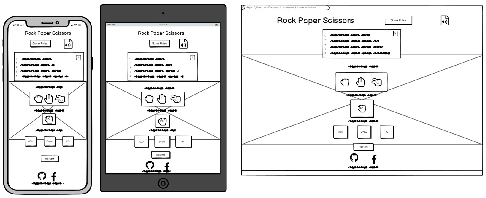
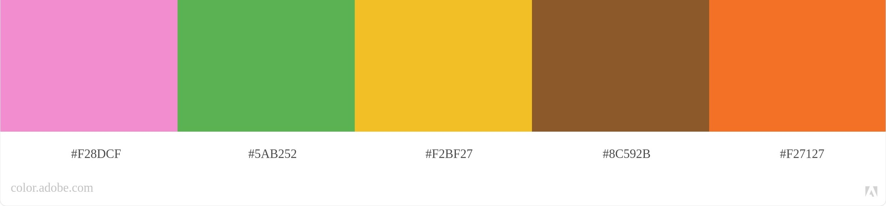

# Rock Paper Scissors Game

## Site Overview

Rock Paper Scissors game is an interactive easy yet super fun game for everyone especially for little children who love to play it often with families and friends. More than often that children are interested in playing games on media screens nowadays. The site intends to target the audience who enjoys play against the computer in their spare time. 

## User Experience UX
* User Stories
  * As a first time user, I want the website to be easily accessible on different devices and work on different browsers.
  * As a first time user, I want the site to have a vivid theme.
  * As a first time user, I want to know what the game rules are and how to play it.
  * As a game user, I want to know the game scores and result of win or lost.
* Site Owner Stories
  
    The purpose of the website is to provide a fun and exciting easy game for young and old to enjoy. The site should be accessible and responsive on different media screens and browsers.
* Wireframe
  
* Design Choice
  * Color Theme
  
      The site uses white color for the background and black color for the text. The uses a lovely picture of two playful children playing the game. The site uses bright colors and different shapes of buttons to enhance better user experience. The design is child and family friendly to attract little audience.
      
      [Color Grid](assets/image/colorgrid.jpg)

  * Typography
      The site's main font-family is Lato that is easy to read. The fall back font-family is Open Sans.

## Existing Features
* Header
* Page
* Footer
* Future Features

## Technologies Userd
* [HTML5]() - to create site's structure of the content.
* [CSS]() - to style the website content.
* [JavaScript]() - to make to site interactive with buttons' clickable functionalities.
* [GitHub]() - to host and deploy the website with its content.
* [GitPod]() - to edit the code and push the code to GitHub page.
## Testing
* Code Validation
* Lighthouse Testing
* Responsiveness Testing
* Browsers Testing
* Bugs

## Deployment
* Site Deployment
* Clone the Project

## Credit
* Media
  * [Adobe Color](https://color.adobe.com/create/color-wheel) - extract the site's color theme.
  * [EightShape Contrast](https://contrast-grid.eightshapes.com/) - color contrast grid.
  * [Google Fonts](https://fonts.google.com/specimen/Lato#standard-styles) - provides the fonts for the site.
## Acknowledgement