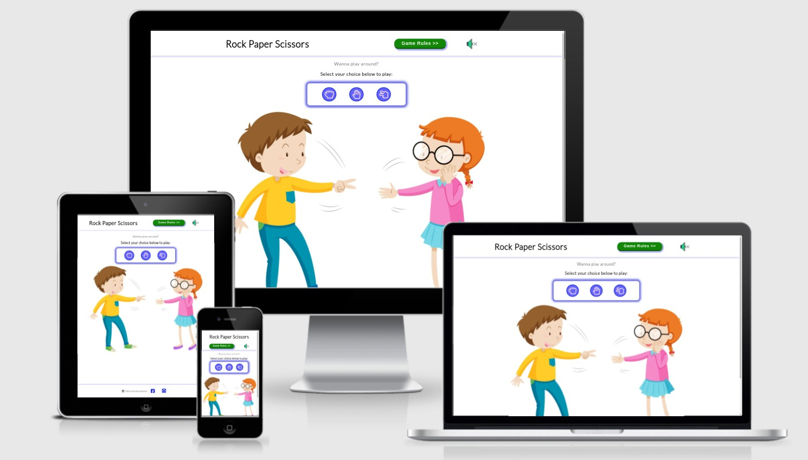
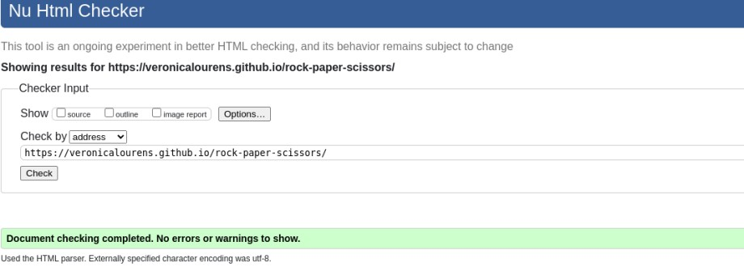

# Rock Paper Scissors Game

## Site Overview

Rock Paper Scissors game is an interactive easy yet super fun game for everyone especially for little children who love to play it often with families and friends. More than often that children are interested in playing games on media screens nowadays. The site intends to target the audience who enjoys play against the computer in their spare time. 

Click here to view the live website - [Rock Paper Scissors](https://veronicalourens.github.io/rock-paper-scissors/)

## User Experience UX
* User Stories
  * As a first time user, I want the website to be easily accessible on different devices and work on different browsers.
  * As a first time user, I want the site to have a vivid theme.
  * As a first time user, I want to know what the game rules are and how to play it.
  * As a game user, I want to know the game scores and result of win or lost.

[Back to top](#rock-paper-scissors)

* Site Owner Stories
  
    The purpose of the website is to provide a fun and exciting easy game for young and old to enjoy. The site should be accessible and responsive on different media screens and browsers.
* Wireframe
  

[Back to top](#rock-paper-scissors)

* Design Choice
  * Color Theme
  
      The site uses white color for the background and black color for the text. The uses a lovely picture of two playful children playing the game. The site uses bright colors and different shapes of buttons to enhance better user experience. The design is child and family friendly to attract little audience.
      
      
      [Color Grid](assets/readmeimg/colorgrid.jpg)

  * Typography
      The site's main font-family is Lato that is easy to read. The fall back font-family is Open Sans.

[Back to top](#rock-paper-scissors)

## Existing Features
The website has only one page. The header on the top, the game area in the middle of the page that has a background picture, short texts and the game choices. The footer on the bottom of the site. 

Some of the page content are hidden when the page loaded. The hidden content would be displayed after user interacts with the page by clicking the buttons. 

The site is responsive accordingly with the different media screen sizes from 320px up to 4000px.

[Back to top](#rock-paper-scissors)

* Header
  
  The Header contains the name of the game **Rock Paper Scissors** on the left side, **Game Rules** button and the sound **on** and **off** image on the right. 
  
  The **Game Rules** button has a hover function that changes background color and horizontally shift to left and right when the mouse moves in and out. 

    

[Back to top](#rock-paper-scissors)

* Main page

  * The pop up box contains the game rules that would be displayed after user clicking the **Game Rules** button on the header.

    

[Back to top](#rock-paper-scissors)

  * A title **Select your choice to play** indicates to start the game by clicking the **hand** buttons. The **hand** buttons are animated that show the zoom and turning effects.
  

    

[Back to top](#rock-paper-scissors)

  * The **computer choice**, **round count**, **messages**, **scores**  and a **Restart** button are displayed on the page after the game started.

    

[Back to top](#rock-paper-scissors)

* Footer
  
  The footer of the page contains a copyright text and social media links.

  

[Back to top](#rock-paper-scissors)

* Future Features

  Additional animation to be added with celebration audio sound and big emojis for praise user’s achievement. An option of user account to be implemented for saving the game records each time user plays the game.

[Back to top](#rock-paper-scissors)

## Technologies Userd
* [HTML5]() - to create site's structure of the content.
* [CSS]() - to style the website content.
* [JavaScript]() - to make to site interactive with buttons' clickable functionalities.
* [GitHub]() - to host and deploy the website with its content.
* [GitPod]() - to edit the code and push the code to GitHub page.

[Back to top](#rock-paper-scissors)

## Testing
* Code Validation

  The **Rock Paper Scissors** site's html and css codes have been validated by the **W3C HTML Markup Valication** and **W3C CSS Validation** services by entering the site's URL address.
  * W3C Markup Validation - No errors found.
    
    

[Back to top](#rock-paper-scissors)

  * W3C CSS Validation - No errors found.

    

[Back to top](#rock-paper-scissors)

* Lighthouse Testing

  The site has been tested on Chrome Incognito window using Dev Tools for both mobile and the desktop.

  * Desktop
  
    

[Back to top](#rock-paper-scissors)

  * Mobile

    

[Back to top](#rock-paper-scissors)

* Responsiveness Testing

  * The website has been manually tested and passed on the **Google Chrome Dev Tools** and the **Responsive Design Checker**.

  |       | **Moto G4** | **Galaxy S5** | **iPhone 5** | **iPad** | **iPad Pro** | **Display < 1200px** | **Display <= 4000px** |
  |-------|:-----------:|:-------------:|:------------:|:--------:|:------------:|:--------------------:|:---------------------:|
  |Render |  &check;    |   &check;     |   &check;    |  &check; |    &check;   |        &check;       |        &check;        |  
  |Image  |  &check;    |   &check;     |   &check;    |  &check; |    &check;   |        &check;       |        &check;        |   
  |Links  |  &check;    |   &check;     |   &check;    |  &check; |    &check;   |        &check;       |        &check;        | 

[Back to top](#rock-paper-scissors)

  * The website has been tested and passed on my own devices. It is fully responsive on two desktops, two laptops, iPad Air and  three mobile phones. 

  |       |**Galaxy Note4**|**Nokia 7 Plus**|**Huawei P30 Pro**|**iPad Air**|**Lenovo E540**|**HP Elitebook 850 G5**|**DELL 2407WFP**|**Yiyama ProLite XB3288UHSU**|
  |-------|:--------------:|:--------------:|:----------------:|:----------:|:-------------:|:---------------------:|:---------------:|:--------------------------:|
  |Render |    &check;     |   &check;      |      &check;     |   &check;  |    &check;    |        &check;        |     &check;     |        &check;             |
  |Image  |    &check;     |   &check;      |      &check;     |   &check;  |    &check;    |        &check;        |     &check;     |        &check;             |
  |Links  |    &check;     |   &check;      |      &check;     |   &check;  |    &check;    |        &check;        |     &check;     |        &check;             |

[Back to top](#rock-paper-scissors)

* Browsers Testing

  The website has been tested on different browers and fully responsive on the devices I have at home while using the following browsers.

  * **Google Chrome**
  * **Microsoft Edge**
  * **Safari**
  * **Mozilla Firefox**

[Back to top](#rock-paper-scissors)

* Resolved Known-bugs
  
  * Background and foreground colors do not have a sufficient contrast ratio;
  
    * Adjusted the background color for the game rules and restart button to solve the problem.
  
  * First Content Paint and Largest Contentful Paint;
  
    * Replaced the background image with compressed and resized image to solve the problem.
  
  * Document doesn't use legible font size;
  
    * Increased the font-size and changed the font size units to slove the problem.
  
  * Overlapping header elements and social media links.

    * Added margin to the header elements and social media links to solve the problem.

[Back to top](#rock-paper-scissors)

## Deployment
* Site Deployment
  
  The Rock Paper Scissors game website is deployed to GitHub page. The site's link -  https://veronicalourens.github.io/rock-paper-scissors/

  Steps to deploy the site as the following:
   * On my GitHub rock-paper-scissors repository, select the **Setting** tab.;
   * Then navigate to the **Pages** on the left side of the page;
   * Select **main** from the **Branch** box and click **save**;
   * Refresh the page, go back to the **Pages**, a ticked message with a link in the green box that shows the site is successfully deployed.
      
      

[Back to top](#rock-paper-scissors)

* Clone the Project
* 
[Back to top](#rock-paper-scissors)

## Credit

* Media
  * [Adobe Color](https://color.adobe.com/create/color-wheel) - extract the site's color theme.
  * [EightShape Contrast](https://contrast-grid.eightshapes.com/) - color contrast grid.
  * [Google Fonts](https://fonts.google.com/specimen/Lato#standard-styles) - provides the fonts for the site.
  * [Freepik](https://www.freepik.com/) - provides the background image for free.
  * [Free icon shop](https://freeiconshop.com/) - provides the sound control icons.
  * [Am I Responsive](http://ami.responsivedesign.is) - generates the site's responsiveness on different screens.
  * [Font Awesome](https://fontawesome.com/) - provides the hand icons used for the game.
  * [W3C School](https://www.w3schools.com/) - provides the extra learning materials.
  * [MDN Web Docs](https://developer.mozilla.org/en-US/) - provides reference materials.
  * [Stack Overflow](https://stackoverflow.com/) - provides extra support information.
  * [Slack]() - provides extra support for the course and the project.
  * [Chrome Dev Tools]() - carries out the **Lighthouse** testing and debug.
  * [W3C Markup Validator](https://validator.w3.org/) - validates the site's HTML code.
  * [W3C CSS Jigsaw Validator](https://jigsaw.w3.org/css-validator/) - validates the site's CSS code.
  * [Youtube](https://www.youtube.com/) - provides extra video learning materials.
  * [Compressor](https://compressor.io/) - to compress the site's image and screenshots.

[Back to top](#rock-paper-scissors)

## Acknowledgement

* Whilst I have tried to deviate as much as possible, there might be some similarities in the code as the Super Cars project was influenced by the code along Love Maths project at [Code Institute]().

* I relied upon the support from Code Institue [online tutors]() and mentor [Precious Ijege](), Slack community and my families. Thanks to all those who support my learning journey. I use W3schools, MDN web docs and stack overflow for general references throughout the project.

* The [Rock Paper Scissors](https://veronicalourens.github.io/rock-paper-scissors/) website is intended for education purpose of completing the Portfolio Project 2 for the Diploma of Full Stack Software Development course at [Code Institue](https://codeinstitute.net/).

[Back to top](#rock-paper-scissors)